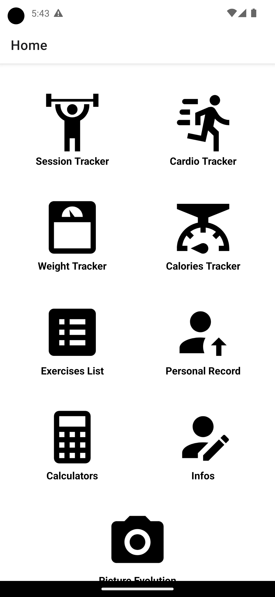

# DimDimMuscu

DimDimMuscu is a gym app developed using Rust for the BackEnd.
It includes a variety of features to help gym-goers achieve their fitness goals.

## Introduction

This app was developed as a personal project to learn more about rust / axum and to create a tool that would be
useful for gym enthusiasts like I am. The app provides a range of features that can help users in their gym journey.

## Technologies Used

The app is built using Rust and axum for the server part, which allow me to write code that is both performant and
secure.

### Api calls

- /connect
    - /signup
    - /login
    - /logoff
    - /delete_user
- /api
    - /users
        - /get_myself
        - /update
    - /muscles
        - /get
    - /exercises

## Features

TODO

[still wip]

- home page
- weight tracker page
- exercise list page
- PR (personal record) page
- Info page

## Screenshots

[soon]

Show home screen

## Next features

- Calorie tracker page
- Workout session page (gym)
- Picture of evolution (once a month to track evolution)
- Home workout
- BMI calculator
- Daily calorie need calculator
- Cardio tracker page
- Import values
- Export/save periodically feature
- Calendar

To improve:

- more tests
- light/dark mode
- language fr/en
- charts for various pages (ex weight)
- also track the % body fat
- make the overall app more "beautiful" (improving style)
